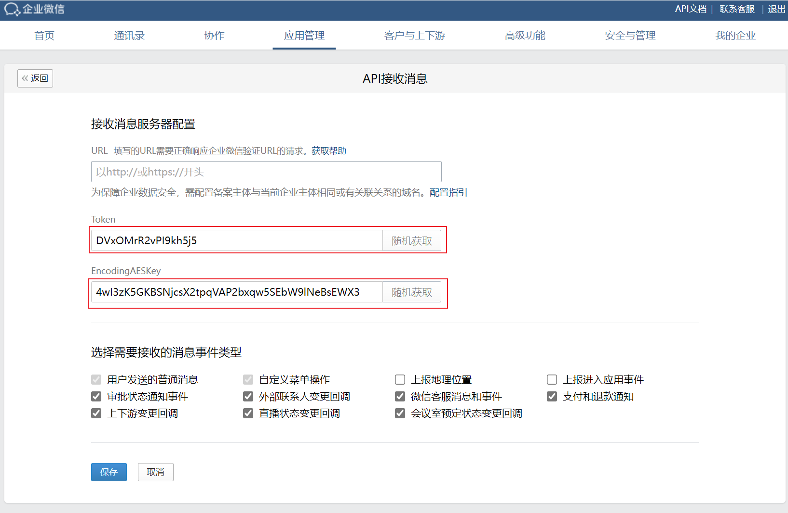

<div id="top"></div>

# 企业微信应用接收消息服务器-认证接口服务

<div align="center">

 

 


</br>
状态 | 稳定

</div>

<details>
  <summary>目录</summary>
  <ol>
    <li>
      <a href="#关于本项目">关于本项目</a>
    </li>
    <li>
      <a href="#构建工具">构建工具</a>
    </li>
    <li>
      <a href="#开始">开始</a>
    </li>
    <li><a href="#贡献">贡献</a></li>
    <li><a href="#许可证">许可证</a></li>
  </ol>
</details>

## 关于本项目

本项目采用 Node + Express 实现非常简单的接口，用来通过企业微信应用开发中接收消息功能的验证。
1. 企业微信应用开发中，如果需要后端发消息，且采用模板卡片消息，就需要先通过企业微信应用管理中的接收消息配置(是的，只要推送消息使用模板卡片消息也需要配置接收消息服务器，并且通过企业微信的认证)
2. 为了方便在开发阶段能够推送模板卡片消息做测试，所以就写了本项目，直接部署到Vercel中，再把和企业微信中主体相同的备案域名解析到Vercel应用，即可通过认证。


### 构建工具

项目使用的主要框架或库。

* [Node.js](https://nodejs.org/en)
* [Express.js](https://expressjs.com/)

## 开始
1. 请先确保已经在 [Vercel](https://vercel.com/) 注册过账户，且已经登录

2. 点击下面按钮，一键部署到Vercel

<div align="center">

[](https://vercel.com/new/clone?repository-url=https%3A%2F%2Fgithub.com%2Fdhbxs%2FWechatWork-Message-API&env=TOKEN&env=ENCODING_AES_KEY&project-name=WechatWork-Message-API&repository-name=WechatWork-Message-API)

</div>

3. 填写环境变量，在企业微信PC网页录管理后台，依次进入：应用管理 -> (你的应用) -> 接收消息 -> 设置API接收 -> 点击随机获取即可拿到Token和EncodingAESKey，并将拿到的结果保存到Vercel的环境变量中

    ```
    TOKEN=XXX
    ENCODING_AES_KEY=XXX
    ```
    
    
4. 点击 Deploy 部署即可
5. 在 Vercel 中添加 Domain，并将你的域名解析到 Vercel 即可
6. 在 [企业微信开发者工具](https://developer.work.weixin.qq.com/resource/devtool) 建立连接 -> 测试回调模式，填写相关信息即可开始测试，测试没问题即可在接收消息服务器配置中配置


## 贡献

贡献让开源社区成为了一个非常适合学习、启发和创新的地方。你所做出的任何贡献都是**受人尊敬**的。

如果你有好的建议，请复刻（fork）本仓库并且创建一个拉取请求（pull request）。你也可以简单地创建一个议题（issue），并且添加标签「enhancement」。不要忘记给项目点一个 star！再次感谢！

1. 复刻（Fork）本项目
2. 创建你的 Feature 分支 (`git checkout -b feature/AmazingFeature`)
3. 提交你的变更 (`git commit -m 'Add some AmazingFeature'`)
4. 推送到该分支 (`git push origin feature/AmazingFeature`)
5. 创建一个拉取请求（Pull Request）


## 许可证

根据 MIT 许可证分发。打开 [LICENSE](LICENSE) 查看更多内容。

<p align="right">(<a href="#top">返回顶部</a>)</p>